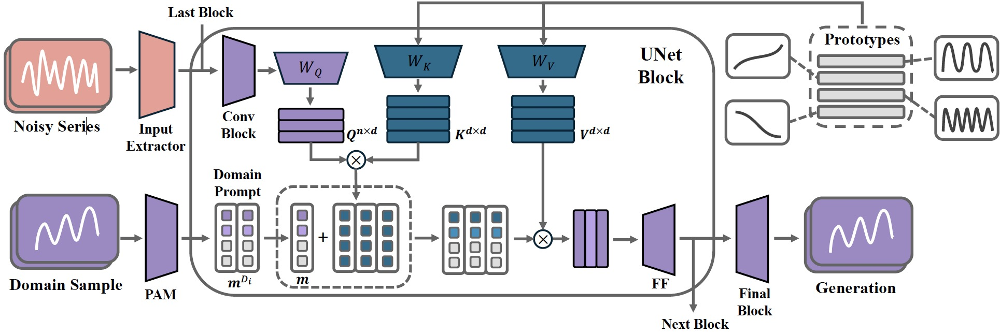

# TimeDP: Learning to Generate Multi-Domain Time Series with Domain Prompts

## Papers
- [TimeDP: Learning to Generate Multi-Domain Time Series with Domain Prompts](https://arxiv.org/pdf/2501.05403)

## Overview
Time series generation is a crucial task for many applications, including data augmentation, forecasting, and privacy-preserving data synthesis. Real-world scenarios often require generating time series data that aligns with given examples. **TimeDP** is designed to address this challenge by learning from multiple domains and generating realistic time series samples based on domain-specific characteristics.

## Introduction
Most existing time series generation models focus on single-domain data, limiting their ability to generalize across various real-world scenarios. **TimeDP** introduces a novel approach that enables multi-domain time series generation using a domain-prompting mechanism. By leveraging diverse time series datasets, TimeDP extracts fundamental patterns and applies them to generate high-quality, domain-specific synthetic time series data.

## Key Features
- **Multi-Domain Time Series Generation:** TimeDP integrates data from various domains and learns shared representations.
- **Time Series Basis Extraction:** A semantic prototype module constructs a basis library for time series data.
- **Few-Shot Domain Prompting:** Given a few example time series from a new domain, TimeDP can generate similar time series with high fidelity.
- **Diffusion-Based Model:** Built upon denoising diffusion probabilistic models (DDPM), ensuring robust and high-quality generation.
- **State-of-the-Art Performance:** TimeDP surpasses existing baselines in both in-domain and unseen domain generation tasks.

## Methodology
### 1. Input Processing
- Time series data from various domains are fed into TimeDP.
- The model extracts fundamental time series features (prototypes) that serve as elementary building blocks.

### 2. Learning Time Series Basis
- A **semantic prototype module** constructs a time series basis library.
- Each prototype represents elementary time series patterns such as trends and seasonality.
- A **prototype assignment module (PAM)** learns domain-specific prototype weights to construct domain prompts.

### 3. Generation with Domain Prompts
- During sampling, a small number of example time series from the target domain are provided.
- TimeDP extracts domain prompts and uses them as conditions for generating new time series.
- The generated time series maintains the statistical and temporal characteristics of the target domain.

## TimeDP framework overview



## Quick Start

### Environment Setup

We recommend using conda as environment manager:
```bash
conda env create -f environment.yml
```

### Data Preparation
Pre-processed dataset can be found with this [link](https://huggingface.co/datasets/YukhoW/TimeDP-Data/blob/main/TimeDP-Data.zip). Set `DATA_ROOT` environment variable to the path of the dataset, or manually modify the `data_path_dict` in `configs/multi_domain_timedp.yaml` to reflect the correct path.

Use `main_train.py` for model training and `visualize.py` for domain prompt visualization. The detailed descriptions about command line arguments are as follows:
| Parameter Name                    | Description                                                                                                        |
| --------------------------------- | ------------------------------------------------------------------------------------------------------------------ |
| `base` (`-b`)                     | Paths to base configuration files.                                                                                 |
| `train` (`-t`)                    | Boolean flag to enable training. (default: true)                                                                   |
| `debug` (`-d`)                    | Boolean flag to enter debug mode. (default: false)                                                                 |
| `seed` (`-s`)                     | Seed for initializing random number generators. (default: 23)                                                      |
| `logdir` (`-l`)                   | Directory for logging data. (default: ./logs)                                                                      |
| `seq_len` (`-sl`)                 | Sequence length for the model. (default: 24)                                                                       |
| `uncond` (`-uc`)                  | Boolean flag for unconditional generation.                                                                         |
| `use_pam` (`-up`)                 | Boolean flag to use the prototype assignment module.                                                               |
| `batch_size` (`-bs`)              | Batch size for training. (default: 128)                                                                            |
| `num_latents` (`-nl`)             | Number of latent variables. (default: 16)                                                                          |
| `overwrite_learning_rate` (`-lr`) | Learning rate to overwrite the config file. (default: None)                                                        |
| `gpus`                            | Comma-separated list of GPU ids to use for training.                                                               |
| `ckpt_name`                       | Checkpoint name to resume from for test or visualization. (default: last)                                          |


## Usage
Training TimeDP:
```bash
python main_train.py --base configs/multi_domain_timedp.yaml --gpus 0, --logdir ./logs/ -sl 168 -up -nl 16 --batch_size 128 -lr 0.0001 -s 0
```

Training without PAM:
```bash
python main_train.py --base configs/multi_domain_timedp.yaml --gpus 0, --logdir ./logs/ -sl 168 --batch_size 128 -lr 0.0001 -s 0
```

Training without domain prompts (unconditional generation model):
```bash
python main_train.py --base configs/multi_domain_timedp.yaml --gpus 0, --logdir ./logs/ -sl 168 --batch_size 128 -lr 0.0001 -s 0 --uncond
```

Visualization of domain prompts:
```bash
python visualize.py --base configs/multi_domain_timedp.yaml --gpus 0, --logdir ./logs/ -sl 168 --batch_size 128 -lr 0.0001 -s 0 --uncond
```


## Citation
If you use TimeDP in your research, please cite:
```
@article{huang2025timedp,
  title={TimeDP: Learning to Generate Multi-Domain Time Series with Domain Prompts},
  author={Yu-Hao Huang, Chang Xu, Yueying Wu, Wu-Jun Li, Jiang Bian},
  journal={AAAI 2025},
  year={2025}
}
```


